# Introduction to Object2Vec

In this workshop you will develop a recommendation engine using SageMaker's built-in algorithm, Object2Vec. We use the same MovieLens dataset as the previous Lab. 

## Prerequisites
### AWS Account

To complete this workshop you'll need an AWS Account with access rights to S3, SageMaker, and to create AWS IAM roles. The code and instructions in this workshop assume only one participant is using a given AWS account at a time. If you try sharing an account with another participant, you'll run into naming conflicts for certain resources. You can work around these by appending a unique suffix to the resources that fail to create due to naming conflicts. However, these instructions do not provide details on the changes required to make this work.

All of the resources you will launch as part of this workshop are eligible for the AWS free tier if your account is less than 12 months old. See the AWS Free Tier page for more details.

### Browser

We recommend you use the latest version of Firefox or Chrome to complete this workshop.

## Steps

1. If you have already completed Steps 1 through 5 from the "Lab 1 - Introduction to Factorization Machines" section of this workshop, please proceed to step 2. Otherwise, go to [Lab 1 - Introduction to Factorization Machines](../Lab1%20-%20Introduction%20to%20Factorization%20Machines) and complete the 5 steps required to setup SageMaker and add the required IAM roles and policies. Also, this workshop assumes all SageMaker instances and S3 buckets are in the Oregon region: us-west-2.

1. Open the notebook, [object2vec_movie_recommendation.ipynb](object2vec_movie_recommendation.ipynb) in this directory. Read carefully about the theory, seek to understand, examine and run each cell. Then, return to these instructions. 

	Don't be alarmed by red log messages while training your model. SageMaker prints ordinary log messages in red. Wall time for training takes about 4 minutes per model. **Do not proceed to the nest step until the notebook has fully completed and each cell has run.**

	When the notebook is completed successfully, go to the [SageMaker console](https://console.aws.amazon.com/sagemaker) and nagivate to **Models** as well as **Endpoints** sections to take a look at the models and enpoints created by the notebook.

1. Go to the IAM console, let's create the Lambda execution role. This role is for our Lambda functions to have sufficient permissions to perform tasks such as getting objects from S3 and invoking an endpoint that is deployed in SageMaker.

     

    - Navigate to IAM in the AWS Console. From the left navigation click on "Roles". Click on "Create Role".
    - From the list of AWS Services choose: Lambda. Click on Next:Permissions.
    - Use the search box to add ```S3FullAccess```, and ```AmazonSageMakerFullAccess``` individually. You do this by searching, clicking onthe on the checkbox, searching again, and selecting the next policy. Note that this is a highly permissive configuration that should not be used in production. It is only intended to facilitate learning in this workshop.
    - After you have added all 3 policies click on Next:Tags, and then Next:Review.
    - For Role Name use Lambda_ServerlessWorkshop_Role.
    - Click on Create role.
    - Return to the SageMaker console.

1. Go to the Lambda console and create a Lambda function that calls 2 endpoints that were deployed in the previous step. 
    - Enter the following values:
        - Name: **Recommendation_Engine_Object2Vec** 
        - Rumitime: **Python 3.6**
        - Role: **Choose an existing role**
        - Existing role: Enter the Lambda Execution Role created in the previous step.
    - Click on the **Create function** button.

1. Open [lambda_function_rec_engine.py](lambda_function_rec_engine.py) and paste the code into Function code section of the Lambda console. 

    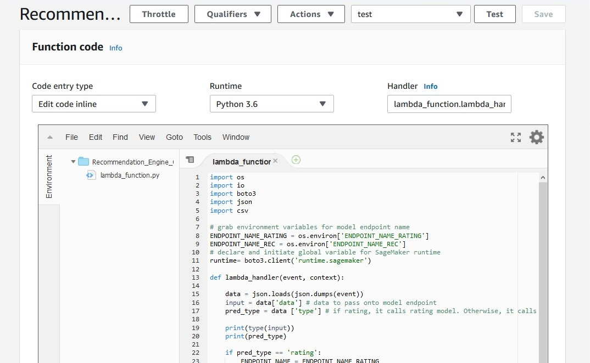

1. On the Lambda console, create 2 environment variables.

    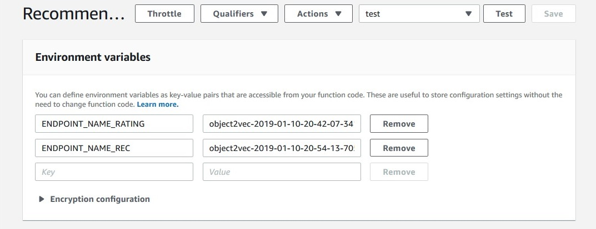

    - The first environment variable with the following specifications:
        - Key: **ENDPOINT_NANE_RATING**
        - Value: **ratingModel** 
    - The second environment variable with the following specifications:
        - Key: **ENDPOINT_NANE_REC**
        - Value: **recommendationModel**
    
    You can find name of your model endpoints on SageMaker console under **Inference** -> **Endpoints** as shown in the following screenshot. Alternatively, you can find them on the notebook you ran to create them. How to know which model is for rating and which for recommendation? Look at the time stamp. Rating model is created first so the date stamp should be earlier for the rating model. 

    

1. Create test event by selecting **Configure test event on the dropdown list next to **Test" button as shown in the following screenshot.

    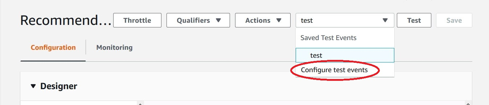

    Enter the following value and click on the Save button on the lower right. 

	```
    {
        "data": "{ \"instances\": [{\"in0\": [789], \"in1\": [286]}]}",
        "type": "rating"
    }
	```

    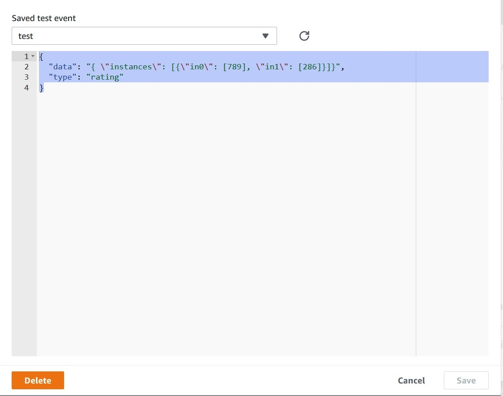

1. Now test your function by clicking on the **Test** button. You should see the output like following. Test recommendation by passing ```"type": "recommendation"``` in your test event to see the movie recommendation, also.

    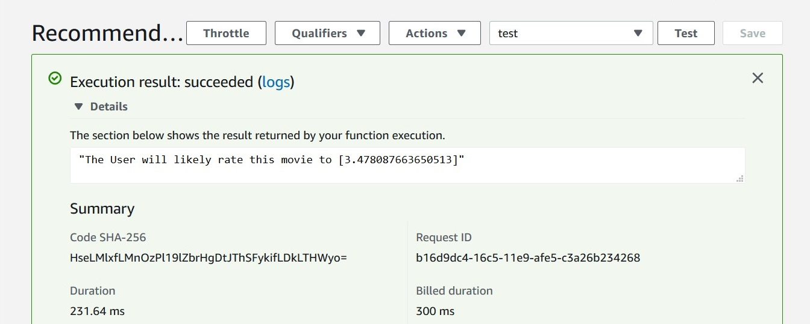

## Movie retrieval in the embedding space

 Next, we will utilize the recommendation model to explore embeddings. We will retrieve a movie in the embedding space since Object2Vec transforms user and movie IDs into embeddings as part of training process. We expect that similar movies should be close-by in the embedding space. You will be creating another Lambda function to find a nearest-neighbor of a given movie ID calling the endpoint of recommendation model we developed in the previous steps. 

1. First, we are going to transfer 2 dataset files to s3 bucket. Open Terminal on the SageMaker instance. See where to find the terminal in the following screenshot. 

    

    Run the following command. Make sure to replace ```your-bucket-name``` with the bucket you created in the previous steps.

    ```
    cd SageMaker/recommendationEngine/Lab2\ -\ Introduction\ to\ Object2Vec/

    aws s3api put-object --bucket your-bucket-name --key object2vec/movielens/ml-100k/ua.base --body ml-100k/ua.base --region us-west-2

    aws s3api put-object --bucket your-bucket-name --key object2vec/movielens/ml-100k/u.item --body ml-100k/u.item --region us-west-2
    ```

1. Next we will go back to the Lambda console and repeat the step 4 this time with the following specification:

    - Enter the following values:
        - Name: **Movie_Retrieval_Object2Vec** 
        - Rumitime: **Python 3.6**
        - Role: **Choose an existing role**
        - Existing role: Enter the Lambda Execution Role created in the previous step.
    - Click on the **Create function** button.
    - Copy the code from [lambda_function_movie_retrieval.py](lambda_function_movie_retrieval.py) and paste it into Function code section of the newly created Lambda function. 
    - Create  environment variable with the following specifications:
        - Key: **ENDPOINT_NAME**
        - Value: **recommendationModel**

1. Set the **Basic settings with the following values:

    - Memory: **512 MB**
    - Timeout: **30 seconds**

    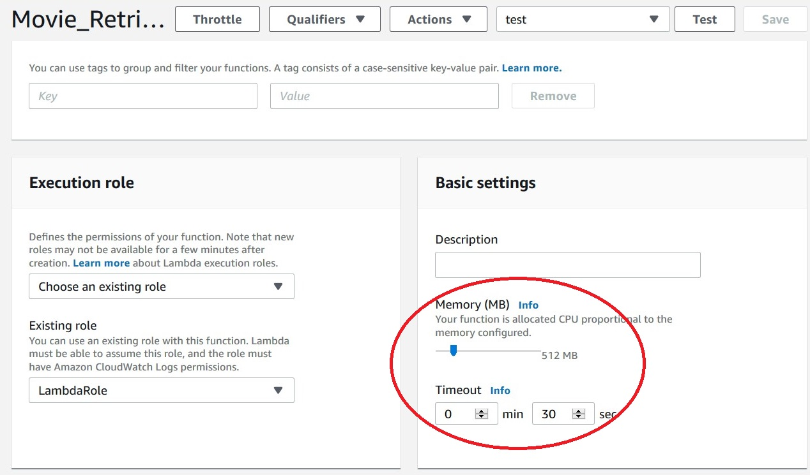

1. This Lambda function uses 2 Lambda Layers. One for jsonlines library and another for numpy library. We will go step by step. 

    First, download **jsonlines_Layers.zip** from the SageMaker notebook instance.

    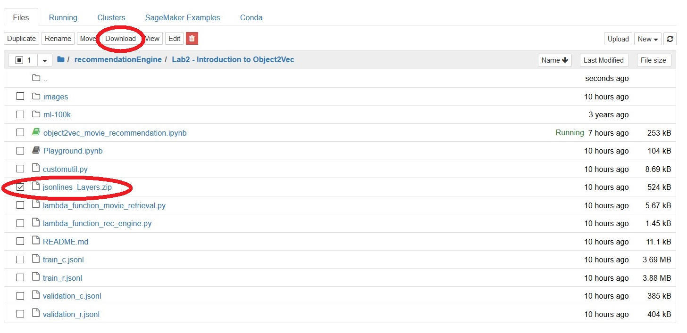 
    
    We will create jsonline layer by clicking on **Create layer** button on upper right corner. 

    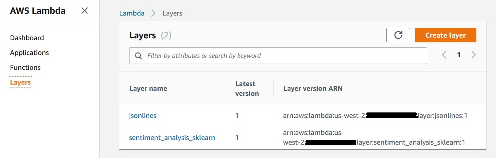

1. Fill in the following value to the consle:

    - Name: **jsonlines**
    - Compatible runtime: **Python 3.6**
    - Upload **jsonlines_Layers.zip**

    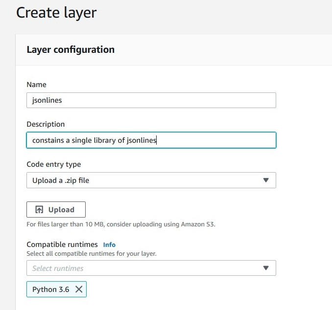

    When the Layer is created, copy the ARN which looks ike this ```arn:aws:lambda:us-west-2:<your_account_number>:layer:jsonlines:1```

1. After the one layer creation, go back to the Movie_Retrieval_Object2Vec function. Click on the **Layers** icon shown in the following screenshot:

    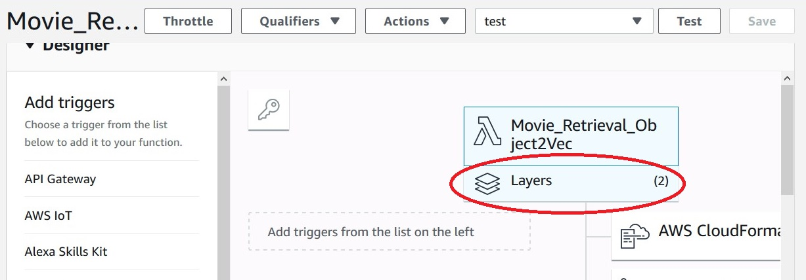

    It wil bring up the following **Referenced layers** pane. Click on **Add a layer** button.

    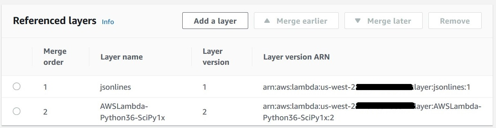

    You will see the following window show up. Select the option **Select from list of runtime compatible layers**. From **Layer** dropdown, select **AWSLambda-Python36-SciPy1x** as it includes numpy which will be referenced in the function code. 

    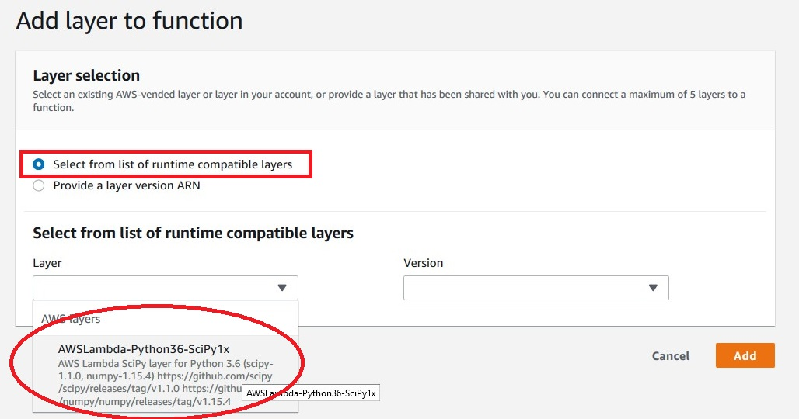

    Repeat the step to add jsonlines layer only this time, select **Provide a layer version ARN** option. Enter the ARN you copied in the previous step in the textbox. 

    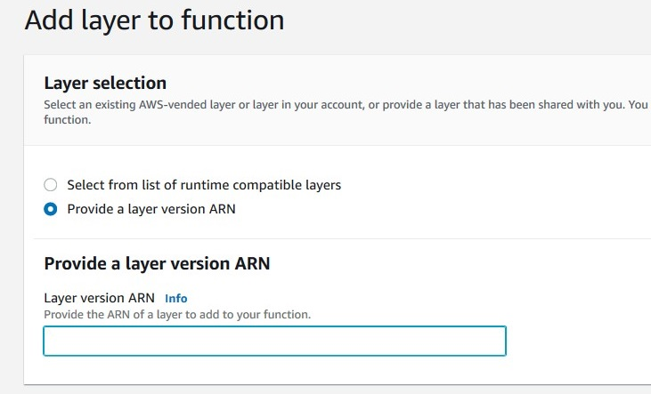

 1. Now you get to test the Lambda function by creating the test event. As we did in the step 6. This time your text event looks like below. Replace ```your-bucket-name``` with real bucket name you created in the Lab 1. Click on **Test** button to get the result. 

    ```
    {
        "bucket_name": "your-bucket-name",
        "movie_id_to_examine": 2
    }
	```
    You can check out what is the closest movie to any movie in the data set. Last time we ran it, the closest movie to Terminator, The (1984) in the embedding space was Die Hard (1988). Note that, the result will likely differ slightly across different runs of the algorithm, due to randomness in initialization of model parameters.

    Just plug in the movie id you want to examine
    For example, the movie ID for Terminator is 195; you can find the movie name and ID pair in the u.item file

## Congratulations!

You've successfully created a recommendation engine using SageMaker's built-in algorithm, Object2Vec. You developed 2 Lambda functions to test the models. This method can apply to recommendation other than movies. After you clean up return to the top level of this repo for [next steps](..). 

## Cleanup
After you have completed the workshop you can delete all of the resources that were created in the following order.
1. Delete 2 SageMaker model endpoints.
1. Stop the SageMaker notebook instance.
1. Delete the SageMaker notebook instance.
1. Delete the S3 Buckets you created. 

